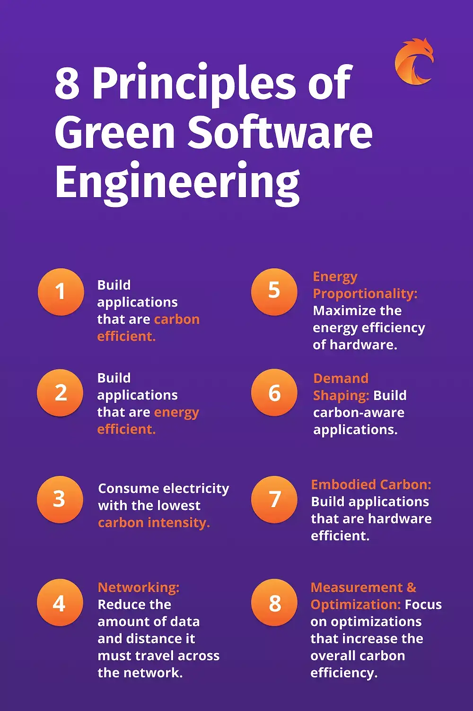

Step 1: Understanding Green Software Development

# **Overview**

- What is green software development?
- What is the environmental impact of traditional software practices?
- What is the goal of green software development?

## **1.1 What Is Green Software Development?**

### **Imagine Writing Code That Helps Save the Planet:**
Green software development is all about creating software that’s not just smart, but also environmentally friendly. It’s like turning your coding superpowers into a force for good, ensuring that your software makes a minimal impact on the planet.

### **Key Ideas :**

- Energy-Efficient Code: Think of your code as a hybrid car. Just like a hybrid uses less fuel, energy-efficient code uses less electricity. For example, an app that quickly performs calculations without wasting power is like a car that gets great mileage.
- Resource Optimization: Imagine you’re packing a suitcase. Instead of throwing everything in, you carefully fold and organize to fit the most in the least space. Similarly, optimized software uses resources like CPU and memory efficiently, ensuring that nothing is wasted.
- Eco-Friendly Design: Picture building a house with solar panels and energy-efficient appliances. In software, this means designing apps that run well on energy-efficient hardware and don’t require constant updates that eat up resources.

### **The 8 Principles of Green Software Engineering:**

## **1.2 What is the environmental impact of traditional software practices ?**
Traditional software practices contribute to environmental degradation through high energy consumption in data centers and devices, significant carbon emissions, and the generation of electronic waste from frequent device turnover due to software updates.

### **1.2.1 Environmental Impact Categories :**

1. High Energy Consumption:

- Data centers and computing devices consume substantial amounts of energy, primarily from fossil fuels.
- This contributes significantly to greenhouse gas emissions and climate change.
  
2. Carbon Emissions:

- Operations like data centers and device manufacturing release carbon dioxide (CO2) and other pollutants.
- emissions worsen environmental degradation and global warming.
  
3. Electronic Waste Generation:

- Software updates often lead to device obsolescence, resulting in large quantities of electronic waste (e-waste).
- Improper disposal of e-waste poses environmental and health risks.

### **1.2.2 Notable Environmental Case Studies :**

1. In 2018, video streaming generated as much greenhouse gas emissions as the whole of Spain.

2. YouTube views of the song “Despacito” consumed the same amount of electricity as five African countries in one year.

3. Training a single natural language processing model produces as much CO2 as 315 return flights from New York to San Francisco.

