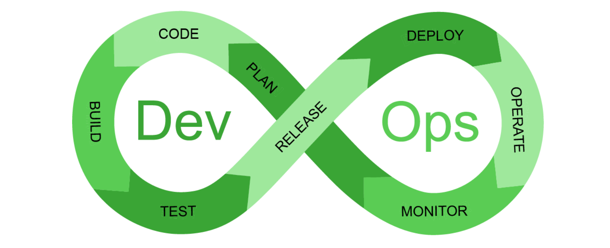

Step 4 in Green Software Development is optimizing testing and the deployment processes

## GREEN DEVOPS AND TESTING:
Green DevOps is a concept that combines the principles of DevOps with a focus on sustainability, incorporating practices that minimise the environmental impact of software development and deployment processes.
Green Testing is a concept that focuses on minimising the environmental impact of testing activities. This includes practices such as reducing test case redundancy, optimising test execution sequences, and prioritising energy-efficient testing approaches

## BENEFITS
- Reduced energy consumption
- Improved resource efficiency
- Enhanced software quality
- Improved Test Quality and Efficiency

## STRATEGIES FOR DEVELOPERS:
1. Incremental Builds: Only rebuild what's necessary, rather than rebuilding the entire project.
2. Implement caching mechanisms: Cache intermediate build results to avoid redundant computations.
3. Optimize pipeline execution order: Execute tasks in a minimizes dependencies and reduces unnecessary rebuilds.
4. Use energy-efficient CI/CD tools: Choose tools with low energy footprints, such as Jenkins or GitLab CI/CD.
5. Configure tool settings for efficiency: Optimize tool settings to reduce energy consumption, such as setting timeouts or idle periods.
6. Use automated testing: Automation helps in speeding up test cycle and minimize the energy and resource consumption associated with manual testing efforts.
7. Use managed Device farm: AWS Device Farm is an application testing service that you can use to test and interact with your Android, iOS, and web apps on real, physical phones and tablets. Device Farm can also be used to execute Selenium tests on different desktop browsers and browser versions.
8. Manage test artifacts: Testing artifacts could include test cases, test scripts, test data and test outputs. Once the testing is over, try to delete data and files (input, output, logs, test evidences).

## Creating a Green CI/CD Pipeline: A Step-by-Step Guide

Step 1: Assess Your Current CI/CD Pipeline
- Identify areas of inefficiency and waste in your current pipeline
- Analyze energy consumption, carbon emissions, and e-waste generation
- Set baseline metrics for future comparison

Step 2: Choose Sustainable Infrastructure
- Select cloud providers with high renewable energy usage (>80%)
- Optimize infrastructure resource utilization and right-sizing
- Implement infrastructure as code (IaC) for efficient provisioning

Step 3: Design Energy-Eff Computing
- Utilize energy-efficient computing architectures and processors
- Leverage dynamic voltage and frequency scaling
- Implement power-saving features in software and hardware

Step 4: Integrate Carbon Footprint Measurement Tools
- Choose a carbon footprint measurement tool (e.g., SustainIT, GreenCode)
- Integrate the tool with your CI/CD pipeline using APIs, plugins, or custom scripts
- Track and report CO2e emissions per deployment, environment, or application

Step 5: Implement Sustainable Software Development Practices
- Adhere to responsible development methodologies (e.g., Green, Sustainable IT)
- Implement sustainable coding practices (e.g., code optimization, efficient algorithms)
- Prioritize open-source software collaborative development

Step 6: Optimize CI/CD Pipeline Efficiency
- Identify and eliminate unnecessary steps in the pipeline
- Optimize pipeline execution times to reduce energy consumption
- Leverage caching, parallel processing, and other efficiency techniques

## Energy-Efficient Testing: A Step-by-Step Guide
Step 1: Identify Test Environment Candidates 
- Analyze test environments to identify opportunities for energy efficiency improvements
- Consider factors such as: Resource utilization (CPU, memory, storage) Energy consumption patterns Idle time and potential for consolidation
- Examples: Identify underutilized test servers with low CPU usage (<20%)
  Detect test environments with high energy consumption during off-peak hours

Step 2: Right-Size Test Environments
- Optimize test environment resource to match workload requirements
- Implement dynamic scaling and resource allocation based on demand
- Examples: Downsize test servers with low CPU usage to reduce energy consumption
  Implement containerization (e.g., Docker) for efficient resource utilization

Step 3: Leverage Virtualization and Cloud
- Migrate test environments to virtualized or cloud-based infrastructure
- Take advantage of built-in energy efficiency features, such as: Dynamic voltage and frequency scaling, Power management and idle resource detection
- Examples: Migrate test environments to Amazon Web Services (AWS) or Microsoft
  Utilize VMware vSphere or other virtualization platforms

Step4: Implement Energy-Efficient Testing Tools
- Select testing tools that prioritize energy efficiency, such as: Headless testing frameworks (e.g., Selenium Grid, Cypress with Github Actions) 

Step 5: Optimize Test Scripts
- Optimize test scripts to reduce energy consumption, such as: Implementing parallel testing, Using-efficient algorithms (e.g., binary search)
- Examples: Implement parallel testing using frameworks like Apache Maven
  Optimize test scripts to reduce CPU usage (<50%))

Step 6: Consolidate Test Environments
- Consolidate test environments to reduce energy consumption, such as: Merging multiple test environments into one Implementing idle resource detection and consolidation
- Examples: Merge three underutilized test servers into one
  Implement idle resource detection using tools like Nagios

Step 7: Schedule Test Environments
- Implement scheduling for test, such as: Scheduling tests to run during off-peak hours Implementing idle resource detection and shutdown
- Examples: Schedule tests to run during nighttime (off-peak hours)
  Implement automatic shutdown of test environments during idle time
